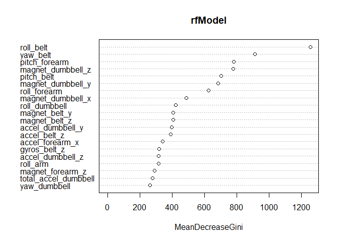

### Executive Summary
Companies use tools such as Jawbone Up, Nike FuelBand, and Fitbit, accumulating a large volume of data about individual activity relatively economically. These kinds of tools are part of the quantified self-movement – a group of practitioners who regularly take measurements about themselves to improve their health, find patterns in their behavior, or because they are tech geeks. this project required to create a prediction/classification model to identify the class of activtity from previously collected data. 

The data for this project come from this source: http://web.archive.org/web/20161224072740/http:/groupware.les.inf.puc-rio.br/har.

Here, after reading loading of the training set, Data cleaning needed to be done due to large amount of near zero variables and presence of NA values. afterwards, a feature selection is done using random forest method to come up with top twenty variables which explains the variabilty across our predictive model. then with comparison to KNN method and RandomForest method, RandomForest provided higher accuracy of 99.08 percent. lastly RandomForest method is used to predict "Classe" for given 20 test cases.

in this dataset, Six young health participants were asked to perform one set of 10 repetitions of the Unilateral Dumbbell Biceps Curl in five different fashions: exactly according to the specification (Class A), throwing the elbows to the front (Class B), lifting the dumbbell only halfway (Class C), lowering the dumbbell only halfway (Class D) and throwing the hips to the front (Class E). this model will predict these classes.

### Loading of Datasets

```r
download.file("https://d396qusza40orc.cloudfront.net/predmachlearn/pml-training.csv","pml-train.csv")
download.file("https://d396qusza40orc.cloudfront.net/predmachlearn/pml-testing.csv","pml-test.csv")
training <- read.csv("pml-train.csv",header = TRUE, sep = ",")
Validation <- read.csv("pml-test.csv",header = TRUE, sep = ",")
```

### Exploratory Data Analysis
Here, we explore the dataset further and check the "classe" variable within all 19,622 observations.

```r
dim(training)
```

```
## [1] 19622   160
```

```r
plot(training$classe,col="red",main="Distribution of classe",ylab="Frequency",xlab="Factors")
```

<!-- -->


### Preprocessing and Data cleaning
three types of variables were excluded from the model at first. those are:  

- Variable those have Near Zero Variance
- first 6 variables, which were qualitative in nature
- Variables with more than fifty percent presence of NA Values

*For Feature Selection,* RandomForest method is used. then with respect to their importance (or ability of explaining variability) top twenty variables were selected from the plot given below. lastly subset the training set with only those twnty predictor variables and one outcome variable (i.e. "classe"). MeanDecreaseValue were calculated as importance value in this model.


```r
library(caret)
library(dplyr)
library(ggplot2)
training <- training[-nearZeroVar(training)]
xNA <- !as.logical(apply(training, 2, function(x){ mean(is.na(x)) >= 0.5}))
training <- training[xNA]
training <- training[-c(1,2,3,4,5,6)]
library(randomForest)
set.seed(665)
rfModel <-randomForest(classe ~ ., data = training)
varImpPlot(rfModel,n.var = 20)
```

<!-- -->

```r
prex <- c( "roll_belt", "yaw_belt","pitch_forearm","magnet_dumbbell_z","pitch_belt","magnet_dumbbell_y","roll_forearm","magnet_dumbbell_x","roll_dumbbell","accel_belt_z","accel_dumbbell_y","magnet_belt_z","magnet_belt_y","accel_dumbbell_z", "accel_forearm_x","roll_arm","gyros_belt_z","magnet_forearm_z","total_accel_dumbbell","gyros_dumbbell_y","classe")
training <- training[names(training) %in% prex]
```

### Dataset Partition 

Dataset were partitioned into trainset (trainx) and testset (testx) with p=0.75

```r
library(caret)
```

```
## Loading required package: lattice
```

```
## Loading required package: ggplot2
```

```r
inTrain <- createDataPartition(y=training$classe, p=0.75, list=FALSE)
trainx <- training[inTrain,]
testx <- training[-inTrain,]
```

### Classification Modelling and Model Selection

from widely available classification algorithm of R, I choose to go with KNN model and RandomForest model due to thier higher accuracy with larger dataset and higher speed compared to other datasets. model1 is trained with KNN model and model 2 with RandomForest. with two plots given below, accuracy of model can be observed. then with confusionMatrix, Model's predictions were crossvalidated with testset's predefined outcome to reach at the accuracy and other parameters.  

model1 shows accuracy rate of : 92.58 percent

model2 shows accuracy rate of : 99.08 percent

model2 (RandomForest) with higher accuracy is selected for predicting later 20 test cases. 

```r
set.seed(665)
model1 <- train(classe ~.,data=trainx, method="knn")
plot(model1,main="Model1 (KNN)")
```

<!-- -->

```r
confusionMatrix(testx$classe, predict(model1,testx))
```

```
## Confusion Matrix and Statistics
## 
##           Reference
## Prediction    A    B    C    D    E
##          A 1373   13    4    5    0
##          B   39  835   45   14   16
##          C    0   50  763   25   17
##          D    3    3   46  745    7
##          E    2   26   27   22  824
## 
## Overall Statistics
##                                          
##                Accuracy : 0.9258         
##                  95% CI : (0.9181, 0.933)
##     No Information Rate : 0.2889         
##     P-Value [Acc > NIR] : < 2.2e-16      
##                                          
##                   Kappa : 0.9061         
##                                          
##  Mcnemar's Test P-Value : 1.763e-06      
## 
## Statistics by Class:
## 
##                      Class: A Class: B Class: C Class: D Class: E
## Sensitivity            0.9689   0.9008   0.8621   0.9186   0.9537
## Specificity            0.9937   0.9713   0.9771   0.9856   0.9809
## Pos Pred Value         0.9842   0.8799   0.8924   0.9266   0.9145
## Neg Pred Value         0.9875   0.9767   0.9699   0.9839   0.9900
## Prevalence             0.2889   0.1890   0.1805   0.1654   0.1762
## Detection Rate         0.2800   0.1703   0.1556   0.1519   0.1680
## Detection Prevalence   0.2845   0.1935   0.1743   0.1639   0.1837
## Balanced Accuracy      0.9813   0.9360   0.9196   0.9521   0.9673
```

```r
model2 <- randomForest(classe ~.,data=trainx)
plot(model2,main="Model2 (RandomForest)")
```

<!-- -->

```r
confusionMatrix(testx$classe, predict(model2,testx))
```

```
## Confusion Matrix and Statistics
## 
##           Reference
## Prediction    A    B    C    D    E
##          A 1392    2    1    0    0
##          B    6  936    7    0    0
##          C    0    7  846    2    0
##          D    0    0   11  793    0
##          E    0    1    3    5  892
## 
## Overall Statistics
##                                           
##                Accuracy : 0.9908          
##                  95% CI : (0.9877, 0.9933)
##     No Information Rate : 0.2851          
##     P-Value [Acc > NIR] : < 2.2e-16       
##                                           
##                   Kappa : 0.9884          
##                                           
##  Mcnemar's Test P-Value : NA              
## 
## Statistics by Class:
## 
##                      Class: A Class: B Class: C Class: D Class: E
## Sensitivity            0.9957   0.9894   0.9747   0.9912   1.0000
## Specificity            0.9991   0.9967   0.9978   0.9973   0.9978
## Pos Pred Value         0.9978   0.9863   0.9895   0.9863   0.9900
## Neg Pred Value         0.9983   0.9975   0.9946   0.9983   1.0000
## Prevalence             0.2851   0.1929   0.1770   0.1631   0.1819
## Detection Rate         0.2838   0.1909   0.1725   0.1617   0.1819
## Detection Prevalence   0.2845   0.1935   0.1743   0.1639   0.1837
## Balanced Accuracy      0.9974   0.9931   0.9862   0.9943   0.9989
```

### Prediction for Test Cases

Using Model2 trained above with RandomForest method is used to predict given twenty test cases. results are given in the output below.

```r
Validation <- read.csv("pml-test.csv",header = TRUE, sep = ",")
testing <- Validation[names(Validation) %in% names(training)]
predict_result <- predict(model2, testing)
predict_result
```

```
##  1  2  3  4  5  6  7  8  9 10 11 12 13 14 15 16 17 18 19 20 
##  B  A  B  A  A  E  D  B  A  A  B  C  B  A  E  E  A  B  B  B 
## Levels: A B C D E
```
